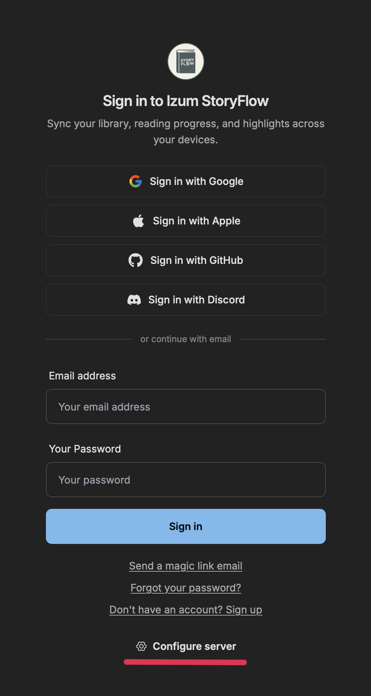
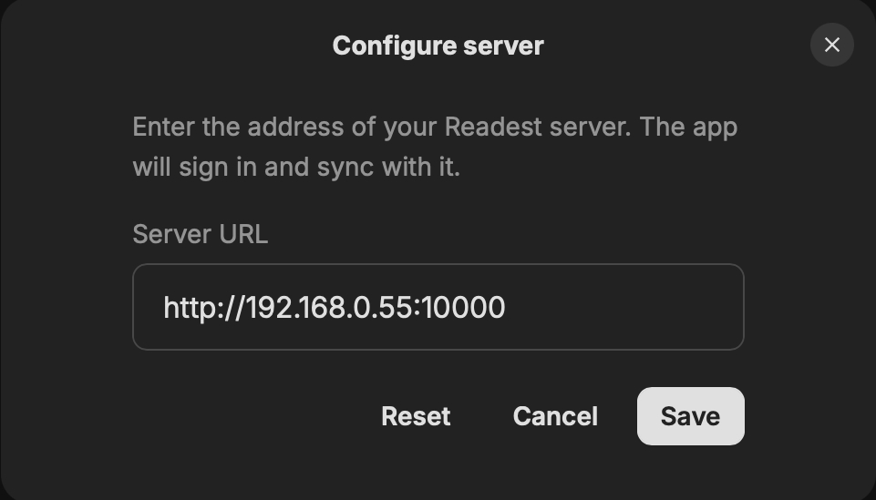

<div align="center">
  <a href="./README_RU.md">
    
  </a>
</div>

<div align="center">
  <a href="http://izum-vinipuhov.com" target="_blank">
    
  </a>
  <h1>Izum StoryFlow</h1>
  <br>

Izum StoryFlow is an open-source ebook reader designed for immersive and deep reading experiences. Built on [Next.js](https://github.com/vercel/next.js) and [Tauri v2](https://github.com/tauri-apps/tauri), it delivers a smooth, cross-platform experience across macOS, Windows, Linux, Android, iOS, and the Web.

[![AGPL Licence][badge-license]](LICENSE)
[![Platforms][badge-platforms]]
<br>
<a href="https://boosty.to/izum_vinipuhov"></a>
<a href="https://t.me/izum_vinipuhov"></a>
<a href="http://izum-vinipuhov.com"></a>
<a href="https://github.com/izum-vinipuhov/Izum-Music"></a>

</div>

## What's New

- 🎁 **Unlimited access** to all app features
- 🧩 **Hybrid import** — the menu now lets you import books, audiobooks, or book + audiobook, download audiobooks from Yandex Books, and set up the Yandex API key
- 🔌 **Client-server mode** — connect the app to your own sync server
- 📚 **Bookshelves** — organize your books on custom shelves

<p align="center">
  
</p>

Download a book, an audiobook, or book + audiobook:

<p align="center">
  
</p>

### Downloading Audiobooks from Yandex Books

**1. Set your Yandex token**

Open the menu, click the gear button, and the **Yandex Token** window will open. Enter your Yandex token and confirm:

<p align="center">
  
</p>

**2. Download a book**

Open the menu and paste the book link, press **Search**, then choose to download the book, the audiobook, or book + audiobook:

<p align="center">
  
</p>

**3. Track your downloads**

Open the menu and find the **Yandex Downloads** button:

<p align="center">
  
</p>

A window will open where you can see what is downloading, how much has been downloaded, pause a download, or cancel it:

<p align="center">
  
</p>

### Bookshelves

Bookshelves for organizing your books. The menu entry (and how to turn it off) is shown below:

<p align="center">
  
</p>

### Connecting the Client to the Server

Open the sign-in screen and click **Configure server**:

<p align="center">
  
</p>

A window will open where you can enter your server address in the form `http://host:port` or `https://host:port`:

<p align="center">
  
</p>

<p align="center">
  <a href="#whats-new">What's New</a> •
  <a href="#features">Features</a> •
  <a href="#planned-features">Planned Features</a> •
  <a href="#screenshots">Screenshots</a> •
  <a href="#downloads">Downloads</a> •
  <a href="#building-from-source">Building from Source</a> •
  <a href="#troubleshooting">Troubleshooting</a> •
  <a href="#support">Support</a> •
  <a href="#license">License</a>
</p>

## Features

<div align="left">✅ Implemented</div>

| **Feature**                                | **Description**                                                                                                        | **Status** |
| ------------------------------------------ | ---------------------------------------------------------------------------------------------------------------------- | ---------- |
| **Unlimited Access**                       | All app features are available without restrictions.                                                                   | ✅         |
| **Multi-Format Support**                   | Support EPUB, PDF, MOBI, KF8 (AZW3), FB2, CBZ, TXT, MD (Markdown).                                                     | ✅         |
| **Scroll/Page View Modes**                 | Switch between scrolling or paginated reading modes.                                                                   | ✅         |
| **Full-Text Search**                       | Search inside a book or across the current library shelf to find relevant sections.                                    | ✅         |
| **Annotations and Highlighting**           | Add highlights, bookmarks, and notes to enhance your reading experience and use instant mode for quicker interactions. | ✅         |
| **Dictionary/Wikipedia Lookup**            | Instantly look up words and terms when reading.                                                                        | ✅         |
| **Parallel Read**                          | Read two books or documents simultaneously in a split-screen view.                                                     | ✅         |
| **Customize Font and Layout**              | Adjust font, layout, theme mode, and theme colors for a personalized experience.                                       | ✅         |
| **Code Syntax Highlighting**               | Read software manuals with rich coloring of code examples.                                                             | ✅         |
| **File Association and Open With**         | Quickly open files in Izum StoryFlow in your file browser with one-click.                                              | ✅         |
| **Library Management**                     | Organize, sort, and manage your entire ebook library.                                                                  | ✅         |
| **Bookshelves**                            | Create custom shelves to organize your books.                                                                          | ✅         |
| **Hybrid Import**                          | Import books, audiobooks, or book + audiobook from local files.                                                        | ✅         |
| **Yandex Books Download**                  | Download ebooks and audiobooks from books.yandex.ru / bookmate.ru with live progress, pause, and cancel.               | ✅         |
| **OPDS/Calibre Integration**               | Integrate OPDS/Calibre to access online libraries and catalogs.                                                        | ✅         |
| **Translate with DeepL and Yandex**        | From a single sentence to the entire book—translate instantly.                                                         | ✅         |
| **Text-to-Speech (TTS) Support**           | Enjoy smooth, multilingual narration—even within a single book.                                                        | ✅         |
| **Read-Along Narration**                   | Play a book's own recorded narration with the text highlighted in step — Kindle Immersion Reading / Audible Read & Listen, on the open EPUB standard. Reads EPUB 3 Media Overlays; pair an ebook with its audiobook using [Storyteller][link-storyteller]. | ✅         |
| **Sync across Platforms**                  | Synchronize book files, reading progress, notes, and bookmarks across all supported platforms.                         | ✅         |
| **Sync with Koreader**                     | Synchronize reading progress, notes, and bookmarks with [Koreader][link-koreader] devices.                             | ✅         |
| **Accessibility**                          | Provides full keyboard navigation and support for screen readers such as VoiceOver, TalkBack, NVDA, and Orca.          | ✅         |
| **Visual & Focus Aids**                    | Reading ruler, paragraph-by-paragraph reading mode, and speed reading features.                                        | ✅         |

## Planned Features

<div align="left">🛠 Building</div>
<div align="left">🔄 Planned</div>

| **Feature**                     | **Description**                                                            | **Priority** |
| ------------------------------- | -------------------------------------------------------------------------- | ------------ |
| **AI-Powered Summarization**    | Generate summaries of books or chapters using AI for quick insights.       | 🛠           |
| **Advanced Reading Stats**      | Track reading time, pages read, and more for detailed insights.            | 🛠           |
| **Handwriting Annotations**     | Add support for handwriting annotations using a pen on compatible devices. | 🔄           |

Stay tuned for continuous improvements and updates! Contributions and suggestions are always welcome—let's build the ultimate reading experience together. 😊

## Screenshots

<p align="center">
  
</p>

<p align="center">
  
</p>

<p align="center">
  
</p>

<p align="center">
  
</p>

<p align="center">
  
</p>

<p align="center">
  
</p>

---

## Downloads

Binaries for Windows, macOS, Linux, and Android are published on the **Releases** page of this repository. For other platforms, see [Building from Source](#building-from-source).

## Building from Source

To build Izum StoryFlow from the latest commit, see [Getting Started](./CONTRIBUTING.md#getting-started).

## Troubleshooting

### 1. Izum StoryFlow Won't Launch on Windows (Missing Edge WebView2 Runtime)

**Symptom**

- When you double-click the executable, nothing happens. No window appears, and Task Manager does not show the process.
- This can affect both the standard installer and the portable version.

**Cause**

- Microsoft Edge WebView2 Runtime is either missing, outdated, or improperly installed on your system. Izum StoryFlow depends on WebView2 to render the interface on Windows.

**How to Fix**

1. Check if WebView2 is installed
   - Open "Add or Remove Programs" (a.k.a. Apps & features) on Windows. Look for "Microsoft Edge WebView2 Runtime."
2. Install or Update WebView2
   - Download the WebView2 Runtime directly from Microsoft: [link](https://developer.microsoft.com/en-us/microsoft-edge/webview2?form=MA13LH).
   - If you prefer an offline installer, download the offline package and run it as an Administrator.
3. Re-run Izum StoryFlow
   - After installing/updating WebView2, launch the app again.
   - If you still encounter problems, reboot your PC and try again.

**Additional Tips**

- If reinstalling once doesn't work, uninstall Edge WebView2 completely, then reinstall it with Administrator privileges.
- Verify your Windows installation has the latest updates from Microsoft.

**Still Stuck?**

- Open an issue in this repository with detailed logs of your environment and the steps you've taken.

### 2. AppImage Launches but Only Shows a Taskbar Icon

On some Arch Linux systems—especially those using Wayland—the Izum StoryFlow AppImage may briefly show an icon in the taskbar and then exit without opening a window.

You might see logs such as:

```
Could not create default EGL display: EGL_BAD_PARAMETER. Aborting...
```

This behavior is usually caused by compatibility issues between the bundled AppImage libraries and the system's EGL / Wayland environment.

**Workaround: Launch with LD_PRELOAD (recommended)**

You can preload the system Wayland client library before launching the AppImage:

```
LD_PRELOAD=/usr/lib/libwayland-client.so /path/to/Izum-StoryFlow.AppImage
```

This workaround has been confirmed to resolve the issue on affected systems.

## Contributors

Izum StoryFlow is open-source, and contributions are welcome! Feel free to open issues, suggest features, or submit pull requests. Please **review our [contributing guidelines](CONTRIBUTING.md) before you start**.

## Support

If Izum StoryFlow has been useful to you, consider supporting the author on [Boosty](https://boosty.to/izum_vinipuhov). Your contribution helps fix bugs faster, improve performance, and keep building great features.

## License

Izum StoryFlow is free software: you can redistribute it and/or modify it under the terms of the [GNU Affero General Public License](https://www.gnu.org/licenses/agpl-3.0.html) as published by the Free Software Foundation, either version 3 of the License, or (at your option) any later version. See the [LICENSE](LICENSE) file for details.

The following libraries and frameworks are used in this software:

- [foliate-js](https://github.com/johnfactotum/foliate-js), which is MIT licensed.
- [zip.js](https://github.com/gildas-lormeau/zip.js), which is licensed under the BSD-3-Clause license.
- [fflate](https://github.com/101arrowz/fflate), which is MIT licensed.
- [PDF.js](https://github.com/mozilla/pdf.js), which is licensed under Apache License 2.0.
- [daisyUI](https://github.com/saadeghi/daisyui), which is MIT licensed.
- [marked](https://github.com/markedjs/marked), which is MIT licensed.
- [next.js](https://github.com/vercel/next.js), which is MIT licensed.
- [react-icons](https://github.com/react-icons/react-icons), which has various open-source licenses.
- [react](https://github.com/facebook/react), which is MIT licensed.
- [tauri](https://github.com/tauri-apps/tauri), which is MIT licensed.

The following fonts are utilized in this software, either bundled within the application or provided through web fonts:

[Bitter](https://fonts.google.com/specimen/Bitter), [Fira Code](https://fonts.google.com/specimen/Fira+Code), [Inter](https://fonts.google.com/specimen/Inter), [Literata](https://fonts.google.com/specimen/Literata), [Merriweather](https://fonts.google.com/specimen/Merriweather), [Noto Sans](https://fonts.google.com/specimen/Noto+Sans), [Roboto](https://fonts.google.com/specimen/Roboto), [LXGW WenKai](https://github.com/lxgw/LxgwWenKai), [MiSans](https://hyperos.mi.com/font/en/), [Source Han](https://github.com/adobe-fonts/source-han-sans/), [WenQuanYi Micro Hei](http://wenq.org/wqy2/)

We would also like to thank the [Web Chinese Fonts Plan](https://chinese-font.netlify.app) for offering open-source tools that enable the use of Chinese fonts on the web.

### Based on Readest

Izum StoryFlow is a fork of [Readest](https://github.com/readest/readest), an open-source ebook reader licensed under the GNU AGPL-3.0. In accordance with the AGPL-3.0 license, this modified version remains free software distributed under the same license, and its complete source code is available in this repository.

---

<div align="center" style="color: gray;">Happy reading with Izum StoryFlow!</div>

[badge-license]: https://img.shields.io/badge/license-AGPL--3.0-teal
[badge-platforms]: https://img.shields.io/badge/platforms-macOS%2C%20Windows%2C%20Linux%2C%20Android%2C%20iOS%2C%20Web%2C%20PWA-green
[link-koreader]: https://github.com/koreader/koreader
[link-storyteller]: https://storyteller-platform.dev/
