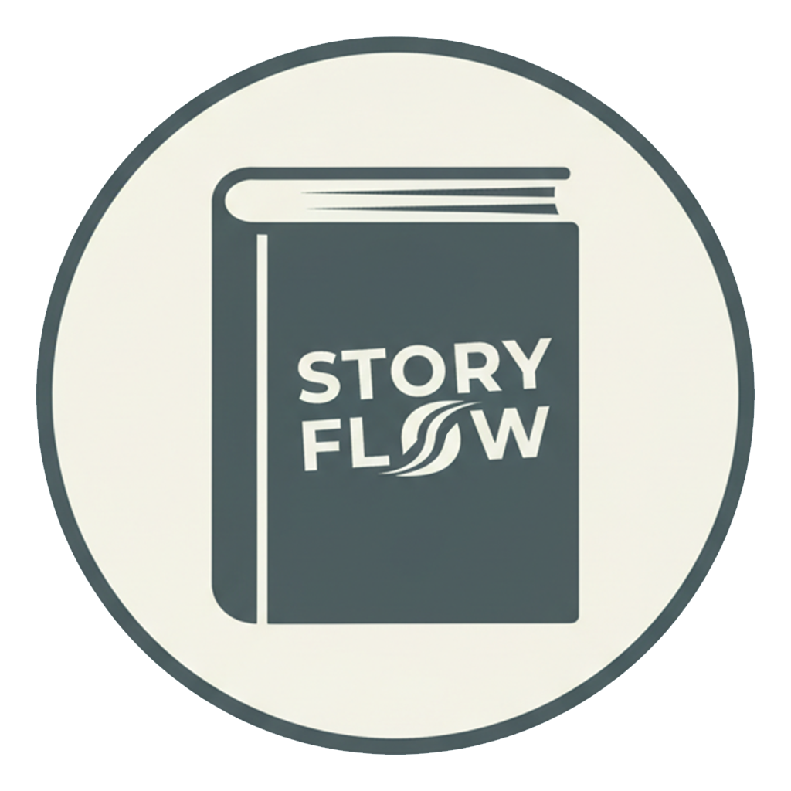
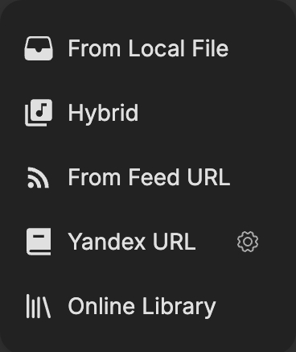
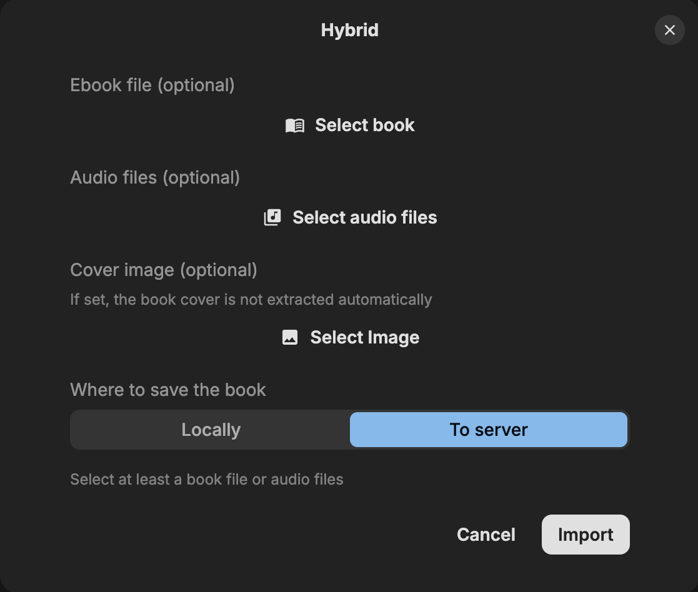
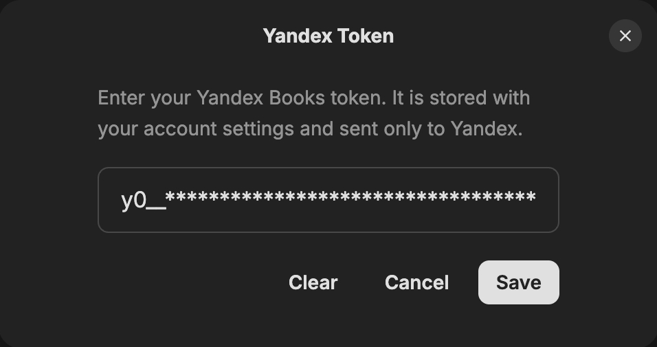
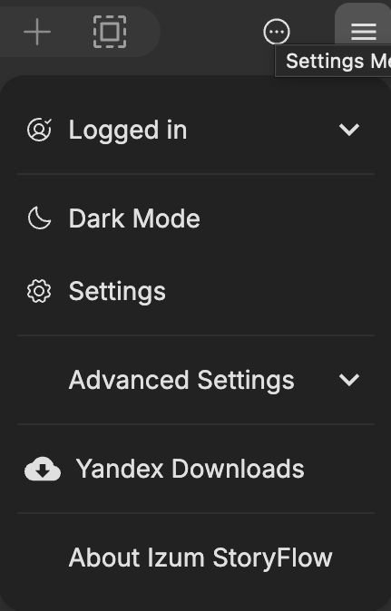
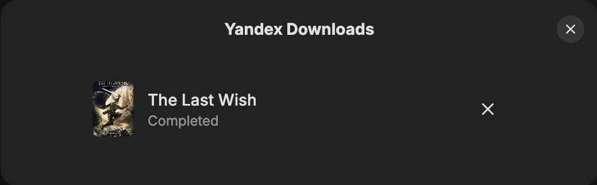
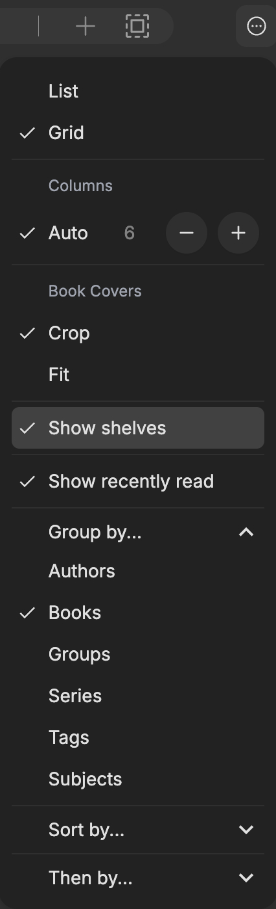

<div align="center">
  <a href="./README.md">
    
  </a>
</div>

<div align="center">
  <a href="http://izum-vinipuhov.com" target="_blank">
    
  </a>
  <h1>Izum StoryFlow</h1>
  <br>

Izum StoryFlow — это читалка электронных книг с открытым исходным кодом, созданная для глубокого и захватывающего чтения. Построенная на [Next.js](https://github.com/vercel/next.js) и [Tauri v2](https://github.com/tauri-apps/tauri), она обеспечивает плавную кроссплатформенную работу на macOS, Windows, Linux, Android, iOS и в вебе.

[![Лицензия AGPL][badge-license]](LICENSE)
[![Платформы][badge-platforms]]
<br>
<a href="https://boosty.to/izum_vinipuhov"></a>
<a href="https://t.me/izum_vinipuhov"></a>
<a href="http://izum-vinipuhov.com"></a>
<a href="https://github.com/izum-vinipuhov/Izum-Music"></a>

</div>

## Что нового

- 🎁 **Неограниченный доступ** ко всем возможностям приложения
- 🧩 **Гибридный импорт** — в меню добавлен импорт книг, аудиокниг или книга + аудиокнига, а также загрузка аудиокниг с Яндекс Книг и настройка API-ключа Яндекса
- 📚 **Книжные полки** — организуйте свои книги на полках

<p align="center">
  
</p>

Загрузка книг, аудиокниг или книга + аудиокнига:

<p align="center">
  
</p>

### Загрузка аудиокниг с Яндекс Книг

**1. Укажите токен Яндекса**

Зайдите в меню, нажмите на кнопку шестерёнки — откроется окно **Yandex Token**. Введите токен Яндекса и подтвердите:

<p align="center">
  
</p>

**2. Скачайте книгу**

Зайдите в меню и вставьте ссылку на книгу, нажмите **Поиск**, затем выберите — скачать книгу, аудиокнигу или книга + аудиокнига:

<p align="center">
  
</p>

**3. Следите за загрузками**

Зайдите в меню и найдите кнопку **Yandex Downloads**:

<p align="center">
  
</p>

Откроется окно, в котором можно посмотреть, что скачивается и сколько уже скачалось, поставить загрузку на паузу или отменить её:

<p align="center">
  
</p>

### Книжные полки

Добавлены книжные полки для организации книг. Пункт меню (и как его выключить) показан на скриншоте ниже:

<p align="center">
  
</p>

<p align="center">
  <a href="#что-нового">Что нового</a> •
  <a href="#возможности">Возможности</a> •
  <a href="#планируемые-возможности">Планируемые возможности</a> •
  <a href="#скриншоты">Скриншоты</a> •
  <a href="#загрузки">Загрузки</a> •
  <a href="#сборка-из-исходников">Сборка из исходников</a> •
  <a href="#решение-проблем">Решение проблем</a> •
  <a href="#поддержка">Поддержка</a> •
  <a href="#лицензия">Лицензия</a>
</p>

## Возможности

<div align="left">✅ Реализовано</div>

| **Возможность**                            | **Описание**                                                                                                            | **Статус** |
| ------------------------------------------ | ----------------------------------------------------------------------------------------------------------------------- | ---------- |
| **Неограниченный доступ**                  | Все возможности приложения доступны без ограничений.                                                                    | ✅         |
| **Поддержка множества форматов**           | EPUB, PDF, MOBI, KF8 (AZW3), FB2, CBZ, TXT, MD (Markdown).                                                              | ✅         |
| **Режимы прокрутки и страниц**             | Переключайтесь между прокруткой и постраничным режимом чтения.                                                          | ✅         |
| **Полнотекстовый поиск**                   | Поиск внутри книги или по текущей библиотечной полке.                                                                   | ✅         |
| **Аннотации и выделения**                  | Добавляйте выделения, закладки и заметки, а быстрый режим ускорит взаимодействие.                                      | ✅         |
| **Поиск в словаре и Википедии**            | Мгновенно узнавайте значение слов и терминов прямо во время чтения.                                                     | ✅         |
| **Параллельное чтение**                    | Читайте две книги или документа одновременно в режиме разделённого экрана.                                              | ✅         |
| **Настройка шрифта и макета**              | Настраивайте шрифт, макет, тему и цвета темы под себя.                                                                  | ✅         |
| **Подсветка синтаксиса кода**              | Читайте руководства по ПО с полноцветной подсветкой примеров кода.                                                      | ✅         |
| **Ассоциация файлов и «Открыть с помощью»** | Открывайте файлы в Izum StoryFlow прямо из файлового менеджера в один клик.                                             | ✅         |
| **Управление библиотекой**                 | Организуйте, сортируйте и управляйте всей своей библиотекой электронных книг.                                          | ✅         |
| **Книжные полки**                          | Создавайте собственные полки для организации книг.                                                                      | ✅         |
| **Гибридный импорт**                       | Импортируйте книги, аудиокниги или книга + аудиокнига из локальных файлов.                                              | ✅         |
| **Загрузка с Яндекс Книг**                 | Скачивайте электронные и аудиокниги с books.yandex.ru / bookmate.ru с прогрессом в реальном времени, паузой и отменой.  | ✅         |
| **Интеграция с OPDS/Calibre**              | Подключайте онлайн-библиотеки и каталоги через OPDS/Calibre.                                                            | ✅         |
| **Перевод с DeepL и Яндексом**             | Переводите мгновенно — от одного предложения до целой книги.                                                            | ✅         |
| **Озвучка текста (TTS)**                   | Наслаждайтесь плавной многоязычной озвучкой — даже в пределах одной книги.                                              | ✅         |
| **Наррация с подсветкой**                  | Воспроизведение собственной аудиодорожки книги с пошаговой подсветкой текста — Kindle Immersion Reading / Audible Read & Listen на открытом стандарте EPUB. Читает EPUB 3 Media Overlays; объединяйте электронную книгу с её аудиокнигой с помощью [Storyteller][link-storyteller]. | ✅         |
| **Синхронизация между платформами**        | Синхронизируйте файлы книг, прогресс чтения, заметки и закладки на всех поддерживаемых платформах.                       | ✅         |
| **Синхронизация с Koreader**               | Синхронизируйте прогресс чтения, заметки и закладки с устройствами [Koreader][link-koreader].                           | ✅         |
| **Доступность**                            | Полная навигация с клавиатуры и поддержка экранных дикторов: VoiceOver, TalkBack, NVDA и Orca.                           | ✅         |
| **Визуальные помощники и фокус**           | Линейка для чтения, режим чтения по абзацам и скорочтение.                                                              | ✅         |

## Планируемые возможности

<div align="left">🛠 В разработке</div>
<div align="left">🔄 Запланировано</div>

| **Возможность**                | **Описание**                                                                    | **Приоритет** |
| ------------------------------ | ------------------------------------------------------------------------------- | ------------- |
| **Саммаризация с помощью ИИ**  | Генерация кратких содержаний книг или глав с помощью ИИ.                        | 🛠            |
| **Расширенная статистика**     | Отслеживайте время чтения, количество прочитанных страниц и многое другое.     | 🛠            |
| **Рукописные аннотации**       | Поддержка рукописных заметок пером на совместимых устройствах.                 | 🔄            |

Следите за постоянными улучшениями и обновлениями! Мы всегда рады вкладу и предложениям — давайте вместе создадим идеальный опыт чтения. 😊

## Скриншоты

<p align="center">
  
</p>

<p align="center">
  
</p>

<p align="center">
  
</p>

<p align="center">
  
</p>

<p align="center">
  
</p>

<p align="center">
  
</p>

---

## Загрузки

Сборки для Windows, macOS, Linux и Android публикуются на странице **Releases** этого репозитория. Для остальных платформ см. [Сборка из исходников](#сборка-из-исходников).

## Сборка из исходников

Чтобы собрать Izum StoryFlow из последнего коммита, см. [Getting Started](./CONTRIBUTING.md#getting-started).

## Решение проблем

### 1. Izum StoryFlow не запускается в Windows (отсутствует Edge WebView2 Runtime)

**Симптом**

- При двойном клике по исполняемому файлу ничего не происходит. Окно не появляется, и в диспетчере задач нет процесса.
- Это может касаться как обычного установщика, так и портативной версии.

**Причина**

- Компонент Microsoft Edge WebView2 Runtime отсутствует, устарел или установлен некорректно. Izum StoryFlow использует WebView2 для отрисовки интерфейса в Windows.

**Как исправить**

1. Проверьте, установлен ли WebView2
   - Откройте «Установка и удаление программ» (Приложения и возможности) в Windows и найдите «Microsoft Edge WebView2 Runtime».
2. Установите или обновите WebView2
   - Скачайте WebView2 Runtime напрямую с сайта Microsoft: [ссылка](https://developer.microsoft.com/en-us/microsoft-edge/webview2?form=MA13LH).
   - Если нужен офлайн-установщик, скачайте офлайн-пакет и запустите его от имени администратора.
3. Запустите Izum StoryFlow снова
   - После установки или обновления WebView2 запустите приложение ещё раз.
   - Если проблема не исчезла, перезагрузите компьютер и повторите попытку.

**Дополнительные советы**

- Если переустановка с первого раза не помогла, полностью удалите Edge WebView2 и установите его заново с правами администратора.
- Убедитесь, что в вашей системе Windows установлены последние обновления от Microsoft.

**Всё ещё не получается?**

- Откройте issue в этом репозитории с подробными логами вашего окружения и описанием выполненных шагов.

### 2. AppImage запускается, но видна только иконка в панели задач

На некоторых системах Arch Linux — особенно с Wayland — AppImage Izum StoryFlow может ненадолго показать иконку в панели задач и завершиться, так и не открыв окно.

В логах можно увидеть что-то вроде:

```
Could not create default EGL display: EGL_BAD_PARAMETER. Aborting...
```

Обычно это связано с несовместимостью библиотек внутри AppImage и окружения EGL / Wayland системы.

**Решение: запуск с LD_PRELOAD (рекомендуется)**

Подгрузите системную библиотеку Wayland перед запуском AppImage:

```
LD_PRELOAD=/usr/lib/libwayland-client.so /path/to/Izum-StoryFlow.AppImage
```

Этот способ подтверждённо решает проблему на затронутых системах.

## Участники

Izum StoryFlow — проект с открытым исходным кодом, и мы рады вашему вкладу! Открывайте issue, предлагайте функции и отправляйте pull request'ы. Пожалуйста, **ознакомьтесь с [правилами для участников](CONTRIBUTING.md), прежде чем начать**.

## Поддержка

Если Izum StoryFlow оказался вам полезен, поддержите автора на [Boosty](https://boosty.to/izum_vinipuhov). Ваша поддержка помогает быстрее исправлять ошибки, улучшать производительность и продолжать создавать отличные функции.

## Лицензия

Izum StoryFlow — свободное программное обеспечение: вы можете распространять и/или изменять его на условиях [GNU Affero General Public License](https://www.gnu.org/licenses/agpl-3.0.html), опубликованной Free Software Foundation, версии 3 или (по вашему выбору) любой более поздней версии. Подробности — в файле [LICENSE](LICENSE).

В этом программном обеспечении используются следующие библиотеки и фреймворки:

- [foliate-js](https://github.com/johnfactotum/foliate-js) — лицензия MIT.
- [zip.js](https://github.com/gildas-lormeau/zip.js) — лицензия BSD-3-Clause.
- [fflate](https://github.com/101arrowz/fflate) — лицензия MIT.
- [PDF.js](https://github.com/mozilla/pdf.js) — лицензия Apache License 2.0.
- [daisyUI](https://github.com/saadeghi/daisyui) — лицензия MIT.
- [marked](https://github.com/markedjs/marked) — лицензия MIT.
- [next.js](https://github.com/vercel/next.js) — лицензия MIT.
- [react-icons](https://github.com/react-icons/react-icons) — различные открытые лицензии.
- [react](https://github.com/facebook/react) — лицензия MIT.
- [tauri](https://github.com/tauri-apps/tauri) — лицензия MIT.

В этом программном обеспечении используются следующие шрифты — встроенные в приложение или подключаемые через веб:

[Bitter](https://fonts.google.com/specimen/Bitter), [Fira Code](https://fonts.google.com/specimen/Fira+Code), [Inter](https://fonts.google.com/specimen/Inter), [Literata](https://fonts.google.com/specimen/Literata), [Merriweather](https://fonts.google.com/specimen/Merriweather), [Noto Sans](https://fonts.google.com/specimen/Noto+Sans), [Roboto](https://fonts.google.com/specimen/Roboto), [LXGW WenKai](https://github.com/lxgw/LxgwWenKai), [MiSans](https://hyperos.mi.com/font/en/), [Source Han](https://github.com/adobe-fonts/source-han-sans/), [WenQuanYi Micro Hei](http://wenq.org/wqy2/)

Также благодарим [Web Chinese Fonts Plan](https://chinese-font.netlify.app) за открытые инструменты, позволяющие использовать китайские шрифты в вебе.

### Основано на Readest

Izum StoryFlow — это форк [Readest](https://github.com/readest/readest), читалки электронных книг с открытым исходным кодом под лицензией GNU AGPL-3.0. В соответствии с лицензией AGPL-3.0 эта модифицированная версия остаётся свободным программным обеспечением, распространяется под той же лицензией, а её полный исходный код доступен в этом репозитории.

---

<div align="center" style="color: gray;">Приятного чтения с Izum StoryFlow!</div>

[badge-license]: https://img.shields.io/badge/license-AGPL--3.0-teal
[badge-platforms]: https://img.shields.io/badge/platforms-macOS%2C%20Windows%2C%20Linux%2C%20Android%2C%20iOS%2C%20Web%2C%20PWA-green
[link-koreader]: https://github.com/koreader/koreader
[link-storyteller]: https://storyteller-platform.dev/
